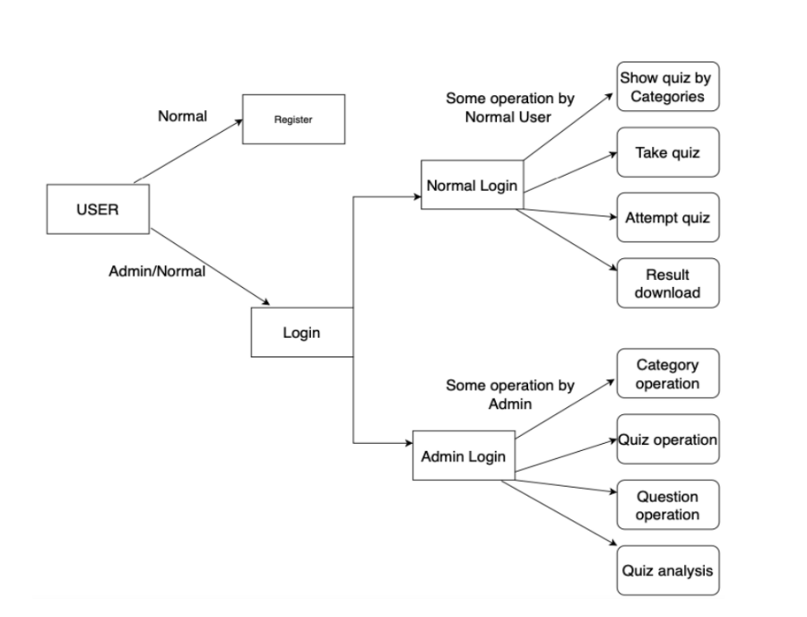
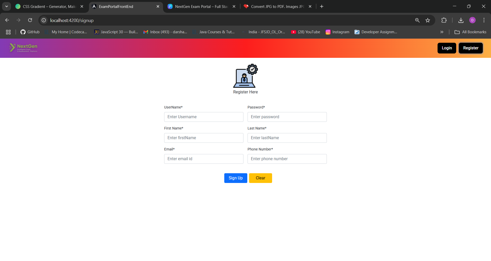
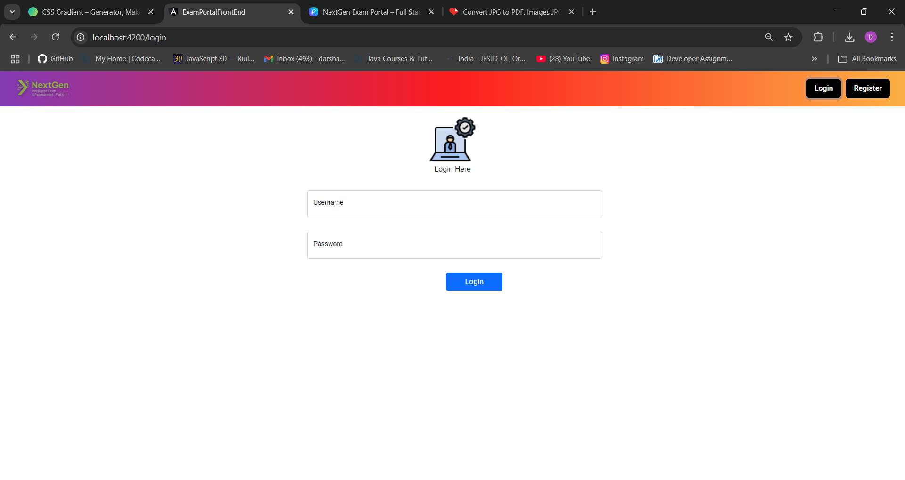
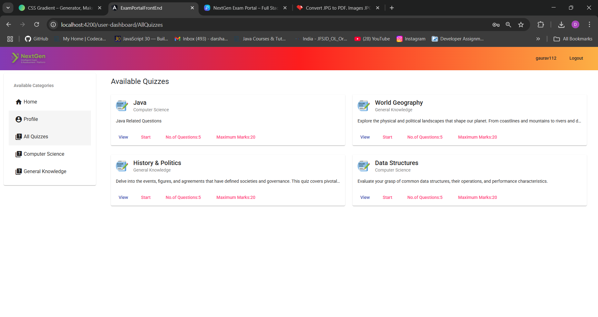
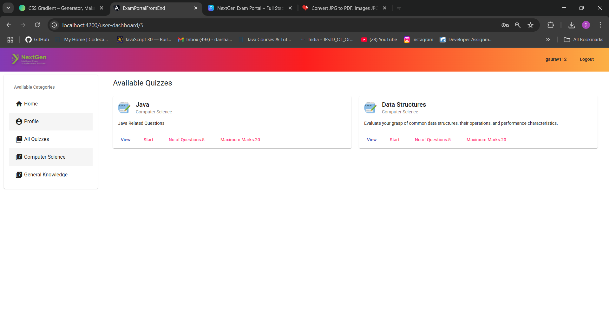
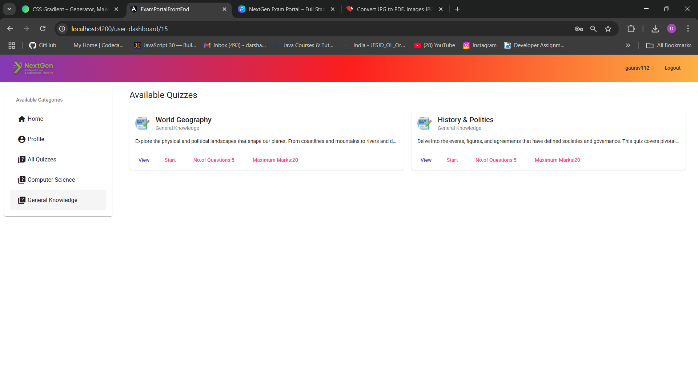

# 📘 NextGen Intelligent Exam & Assessment Platform

An AI-powered, full-stack web application designed for secure, scalable, and adaptive online examinations. Built using **Java Spring Boot** for the backend and **Angular** for the frontend, this platform supports real-time analytics, dynamic question generation, and role-based access control.

---

## 📋 Table of Contents

- [Features](#-features)
- [Screenshots](#-screenshots)
- [Tech Stack](#️-tech-stack)
- [Architecture](#-architecture)
- [Project Structure](#-project-structure)
- [Prerequisites](#-prerequisites)
- [Installation & Setup](#-installation--setup)
- [Configuration](#-configuration)
- [API Documentation](#-api-documentation)
- [Database Schema](#-database-schema)
- [Security Implementation](#-security-implementation)
- [Running the Application](#-running-the-application)
- [Testing](#-testing)
- [Deployment](#-deployment)
- [Troubleshooting](#-troubleshooting)
- [Contributing](#-contributing)
- [License](#-license)
- [Acknowledgments](#-acknowledgments)

---

## 🚀 Features

### Core Features
- 🔐 **Secure Authentication & Authorization**
  - JWT-based token authentication
  - Role-based access control (Admin/User)
  - Password encryption using BCrypt
  - Session management

- 📝 **Exam Management**
  - Create, update, and delete quizzes
  - Organize quizzes by categories
  - Set quiz properties (max marks, number of questions, active status)
  - Dynamic question shuffling

- ❓ **Question Management**
  - Multiple Choice Questions (MCQs) with 4 options
  - Support for image-based questions
  - Add, update, and delete questions
  - Question association with quizzes

- 👥 **User Management**
  - User registration and profile management
  - Admin dashboard for user management
  - View all users and admins
  - User role assignment

- 📊 **Category Management**
  - Create and organize categories
  - Sort categories alphabetically
  - Category-based quiz filtering

- 🎯 **Quiz Taking Experience**
  - User-friendly quiz interface
  - Pre-quiz instructions page
  - Quiz timer and navigation
  - Question randomization
  - Results submission

### Admin Features
- Dashboard with overview statistics
- Create and manage categories
- Create and manage quizzes
- Add questions to quizzes
- View all users and admins
- Manage user roles

### User Features
- Browse available quizzes by category
- Take quizzes
- View profile information
- Access quiz instructions before starting

> 📸 **Visual Tour:** Check out the [Screenshots Section](#-screenshots) below to see the platform in action!

---

## 📸 Screenshots

This section provides a visual walkthrough of the NextGen Exam Portal, showcasing the user journey from registration to quiz taking and admin management.

### Step 1: Home Page / Landing Page
The welcoming home page provides an overview of the platform and easy navigation to registration and login.


*The landing page with navigation to login and registration*

---

### Step 2: User Registration
New users can create an account by filling out the registration form with their details.


*User registration form where new users can sign up*

---

### Step 3: User Login
Registered users can securely log in using their credentials to access the platform.


*Secure login page with JWT authentication*

---

### Step 4: User Dashboard
After login, users are presented with a dashboard showing available quiz categories.


*User dashboard displaying available quiz categories*

---

### Step 5: Quiz Selection
Users can browse and select quizzes from different categories to take.


*Quiz selection interface showing available quizzes in a category*

---

### Step 6: Quiz Taking Interface
The quiz interface allows users to answer questions with a clean and intuitive design.


*Interactive quiz interface for taking exams*

---

### Step 7: Admin Dashboard
Administrators have access to a comprehensive dashboard for managing quizzes, categories, questions, and users.


*Admin dashboard with management tools for quizzes, categories, questions, and users*

---

## 🛠️ Tech Stack

### Backend
- **Language:** Java 17
- **Framework:** Spring Boot 2.7.0
- **Security:** Spring Security with JWT
- **ORM:** Hibernate (via Spring Data JPA)
- **Database:** MySQL 8.0+
- **Build Tool:** Maven
- **Testing:** JUnit, Spring Security Test
- **JWT Library:** io.jsonwebtoken (jjwt 0.9.1)

### Frontend
- **Framework:** Angular 19.2.15
- **Language:** TypeScript 5.8.3
- **UI Libraries:**
  - Angular Material 13.3.8
  - Angular CDK 13.3.8
  - SweetAlert2 11.4.17
- **State Management:** RxJS 7.5.0
- **Build Tool:** Angular CLI 19.2.17
- **Testing:** Jasmine, Karma

### DevOps & Tools
- **Version Control:** Git & GitHub
- **API Testing:** Postman (recommended)
- **Containerization:** Docker (planned)
- **CI/CD:** Jenkins (planned)
- **Orchestration:** Kubernetes (planned)

---

## 🏗️ Architecture

### System Architecture
```
┌─────────────────┐         ┌─────────────────┐
│   Angular UI    │ ◄─────► │  Spring Boot    │
│   (Frontend)    │  HTTP   │   (Backend)     │
└─────────────────┘         └─────────────────┘
                                      │
                                      ▼
                            ┌─────────────────┐
                            │   MySQL Database│
                            └─────────────────┘
```

### Security Flow
```
User Login → JWT Token Generation → Token Validation → Protected Resource Access
```

---

## 📁 Project Structure

### Backend Structure
```
Backend_Server/
├── src/
│   ├── main/
│   │   ├── java/com/example/ExamPortal/
│   │   │   ├── config/              # Security configuration
│   │   │   │   ├── JwtUtil.java
│   │   │   │   ├── JwtAuthenticationFilter.java
│   │   │   │   ├── JwtAuthenticationEntryPoint.java
│   │   │   │   └── MySecurityConfig.java
│   │   │   ├── controller/          # REST Controllers
│   │   │   │   ├── AuthenticateController.java
│   │   │   │   ├── UserController.java
│   │   │   │   ├── CategoryController.java
│   │   │   │   ├── QuizController.java
│   │   │   │   └── QuestionController.java
│   │   │   ├── service/             # Business logic layer
│   │   │   │   ├── UserService.java
│   │   │   │   ├── UserServiceImpl.java
│   │   │   │   ├── CategoryService.java
│   │   │   │   ├── CategoryServiceImpl.java
│   │   │   │   ├── QuizService.java
│   │   │   │   ├── QuizServiceImpl.java
│   │   │   │   ├── QuestionService.java
│   │   │   │   ├── QuestionServiceImpl.java
│   │   │   │   └── UserDetailsServiceImpl.java
│   │   │   ├── repository/          # Data access layer
│   │   │   │   ├── UserRepository.java
│   │   │   │   ├── RoleRepository.java
│   │   │   │   ├── CategoryRepository.java
│   │   │   │   ├── QuizRepository.java
│   │   │   │   └── QuestionRepository.java
│   │   │   ├── models/              # User & Security models
│   │   │   │   ├── User.java
│   │   │   │   ├── Role.java
│   │   │   │   ├── UserRole.java
│   │   │   │   ├── Authority.java
│   │   │   │   ├── JwtRequest.java
│   │   │   │   └── JwtResponse.java
│   │   │   ├── examModels/          # Exam domain models
│   │   │   │   ├── Category.java
│   │   │   │   ├── Quiz.java
│   │   │   │   └── Question.java
│   │   │   └── helper/              # Exception classes
│   │   │       ├── UserNotFoundException.java
│   │   │       └── UserFoundException.java
│   │   └── resources/
│   │       └── application.properties
│   └── test/                        # Test files
├── pom.xml                          # Maven dependencies
└── mvnw                            # Maven wrapper
```

### Frontend Structure
```
Frontend/
├── src/
│   ├── app/
│   │   ├── pages/
│   │   │   ├── home/                # Landing page
│   │   │   ├── login/               # Login page
│   │   │   ├── signup/              # Registration page
│   │   │   ├── profile/             # User profile
│   │   │   ├── admin/               # Admin pages
│   │   │   │   ├── dashboard/
│   │   │   │   ├── welcome/
│   │   │   │   ├── add-category/
│   │   │   │   ├── view-categories/
│   │   │   │   ├── add-quiz/
│   │   │   │   ├── view-quizzes/
│   │   │   │   ├── update-quiz/
│   │   │   │   ├── add-questions/
│   │   │   │   ├── view-quiz-questions/
│   │   │   │   ├── all-users/
│   │   │   │   ├── all-admins/
│   │   │   │   └── sidebar/
│   │   │   └── user/                # User pages
│   │   │       ├── user-dashboard/
│   │   │       ├── load-quiz/
│   │   │       ├── prequiz/
│   │   │       ├── start-quiz/
│   │   │       └── sidebar/
│   │   ├── Components/              # Shared components
│   │   │   ├── navbar/
│   │   │   └── footer/
│   │   ├── Services/                # Angular services
│   │   │   ├── Login Services/
│   │   │   ├── User Services/
│   │   │   ├── Category Services/
│   │   │   ├── Quiz Services/
│   │   │   ├── Questions Services/
│   │   │   ├── Auth and helper/
│   │   │   ├── Admin Gurd/
│   │   │   └── User Gurd/
│   │   ├── app.component.ts
│   │   ├── app.module.ts
│   │   └── app-routing.module.ts    # Routing configuration
│   ├── assets/                      # Static assets
│   ├── environments/                # Environment configs
│   └── index.html
├── angular.json                     # Angular configuration
├── package.json                     # NPM dependencies
└── tsconfig.json                    # TypeScript configuration
```

---

## 📦 Prerequisites

Before you begin, ensure you have the following installed:

- **Java Development Kit (JDK)** 17 or higher
- **Maven** 3.6+ (or use Maven wrapper)
- **Node.js** 16.x or higher
- **npm** 8.x or higher (comes with Node.js)
- **Angular CLI** 19.x (`npm install -g @angular/cli`)
- **MySQL** 8.0 or higher
- **Git** (for version control)
- **IDE** (IntelliJ IDEA, Eclipse, or VS Code recommended)

---

## 🚀 Installation & Setup

### 1. Clone the Repository

```bash
git clone <repository-url>
cd NextGen_Exam_portal
```

### 2. Backend Setup

#### Step 1: Database Configuration

1. Create a MySQL database:
```sql
CREATE DATABASE examportal;
```

2. Update database credentials in `Backend_Server/src/main/resources/application.properties`:
```properties
spring.datasource.url=jdbc:mysql://localhost:3306/examportal?useSSL=false&allowPublicKeyRetrieval=true&serverTimezone=UTC
spring.datasource.username=your_username
spring.datasource.password=your_password
```

#### Step 2: Build and Run Backend

```bash
cd Backend_Server

# Using Maven wrapper (recommended)
./mvnw clean install

# Or using Maven directly
mvn clean install

# Run the application
./mvnw spring-boot:run

# Or
mvn spring-boot:run
```

The backend server will start on `http://localhost:8077`

### 3. Frontend Setup

#### Step 1: Install Dependencies

```bash
cd Frontend

# Install Node modules
npm install
```

#### Step 2: Configure API Endpoint

Update `Frontend/src/environments/environment.ts`:
```typescript
export const environment = {
  production: false,
  apiUrl: 'http://localhost:8077'  // Backend API URL
};
```

#### Step 3: Run the Frontend

```bash
# Start development server
ng serve

# Or
npm start
```

The frontend application will be available at `http://localhost:4200`

---

## ⚙️ Configuration

### Backend Configuration (`application.properties`)

```properties
# Server Configuration
server.port=8077

# Database Configuration
spring.datasource.url=jdbc:mysql://localhost:3306/examportal?useSSL=false&allowPublicKeyRetrieval=true&serverTimezone=UTC
spring.datasource.username=root
spring.datasource.password=your_password
spring.jpa.properties.hibernate.dialect=org.hibernate.dialect.MySQL5InnoDBDialect
spring.jpa.hibernate.ddl-auto=update

# Logging Configuration
logging.level.org.springframework.security=WARN
```

### Frontend Configuration

#### Environment Variables (`environment.ts`)

```typescript
export const environment = {
  production: false,
  apiUrl: 'http://localhost:8077'
};
```

#### Production Environment (`environment.prod.ts`)

```typescript
export const environment = {
  production: true,
  apiUrl: 'https://your-production-api-url.com'
};
```

---

## 🧩 API Documentation

### Base URL
```
http://localhost:8077
```

### Authentication Endpoints

#### 1. Generate JWT Token (Login)
```http
POST /generate-token
Content-Type: application/json

{
  "username": "user123",
  "password": "password123"
}
```

**Response:**
```json
{
  "token": "eyJhbGciOiJIUzI1NiIsInR5cCI6IkpXVCJ9..."
}
```

#### 2. Get Current User
```http
GET /current-user
Authorization: Bearer {token}
```

**Response:**
```json
{
  "id": 1,
  "username": "user123",
  "firstName": "John",
  "lastName": "Doe",
  "email": "john@example.com",
  "phoneNo": "1234567890",
  "enabled": true,
  "profile": "default.png"
}
```

### User Management Endpoints

#### 3. Create User (Registration)
```http
POST /user/
Content-Type: application/json

{
  "username": "newuser",
  "password": "password123",
  "firstName": "John",
  "lastName": "Doe",
  "email": "john@example.com",
  "phoneNo": "1234567890",
  "profile": "default.png"
}
```

#### 4. Get User by Username
```http
GET /user/{username}
Authorization: Bearer {token}
```

#### 5. Get All Users (Admin Only)
```http
GET /user/users/all
Authorization: Bearer {admin_token}
```

#### 6. Get All Admins (Admin Only)
```http
GET /user/admins/all
Authorization: Bearer {admin_token}
```

#### 7. Delete User
```http
DELETE /user/{userId}
Authorization: Bearer {token}
```

### Category Endpoints

#### 8. Add Category
```http
POST /category/
Content-Type: application/json
Authorization: Bearer {token}

{
  "title": "Programming",
  "description": "Programming related quizzes"
}
```

#### 9. Get All Categories
```http
GET /category/
```

#### 10. Get Category by ID
```http
GET /category/{categoryId}
```

#### 11. Get Sorted Categories
```http
GET /category/sorted
```

#### 12. Update Category
```http
PUT /category/
Content-Type: application/json
Authorization: Bearer {token}

{
  "cid": 1,
  "title": "Updated Title",
  "description": "Updated description"
}
```

#### 13. Delete Category
```http
DELETE /category/{categoryId}
Authorization: Bearer {token}
```

### Quiz Endpoints

#### 14. Add Quiz
```http
POST /quiz/
Content-Type: application/json
Authorization: Bearer {token}

{
  "title": "Java Basics Quiz",
  "description": "Test your Java knowledge",
  "maxMarks": "100",
  "noOfQuestions": "10",
  "active": true,
  "category": {
    "cid": 1
  }
}
```

#### 15. Get All Quizzes
```http
GET /quiz/
```

#### 16. Get Quiz by ID
```http
GET /quiz/{qId}
```

#### 17. Update Quiz
```http
PUT /quiz/
Content-Type: application/json
Authorization: Bearer {token}

{
  "qid": 1,
  "title": "Updated Quiz Title",
  "description": "Updated description",
  "maxMarks": "100",
  "noOfQuestions": "10",
  "active": true
}
```

#### 18. Delete Quiz
```http
DELETE /quiz/{qId}
Authorization: Bearer {token}
```

#### 19. Get Quizzes by Category
```http
GET /quiz/category/{cId}
```

#### 20. Get Active Quizzes
```http
GET /quiz/active
```

#### 21. Get Active Quizzes by Category
```http
GET /quiz/category/active/{cid}
```

### Question Endpoints

#### 22. Add Question
```http
POST /question/
Content-Type: application/json
Authorization: Bearer {token}

{
  "content": "What is Java?",
  "option1": "A programming language",
  "option2": "A coffee brand",
  "option3": "An island",
  "option4": "A framework",
  "answer": "A programming language",
  "quiz": {
    "qid": 1
  }
}
```

#### 23. Get Questions for Quiz (Randomized - for Users)
```http
GET /question/quiz/{qid}
Authorization: Bearer {token}
```

#### 24. Get All Questions for Quiz (Admin View)
```http
GET /question/quiz/all/{qid}
Authorization: Bearer {token}
```

#### 25. Get Question by ID
```http
GET /question/{quesId}
```

#### 26. Update Question
```http
PUT /question/
Content-Type: application/json
Authorization: Bearer {token}

{
  "quesId": 1,
  "content": "Updated question?",
  "option1": "Option 1",
  "option2": "Option 2",
  "option3": "Option 3",
  "option4": "Option 4",
  "answer": "Option 1"
}
```

#### 27. Delete Question
```http
DELETE /question/{qId}
Authorization: Bearer {token}
```

### Authentication Headers

All protected endpoints require JWT token in the Authorization header:
```
Authorization: Bearer {your_jwt_token}
```

---

## 🗄️ Database Schema

### Entity Relationship Diagram

```
┌─────────────┐         ┌──────────────┐         ┌─────────────┐
│    User     │◄───────►│  UserRole    │◄───────►│    Role     │
└─────────────┘         └──────────────┘         └─────────────┘
                                                         
┌─────────────┐         ┌──────────────┐         ┌─────────────┐
│  Category   │◄───────►│     Quiz     │◄───────►│  Question   │
└─────────────┘         └──────────────┘         └─────────────┘
```

### Tables

#### 1. users
- `id` (BIGINT, Primary Key, Auto Increment)
- `username` (VARCHAR, Unique)
- `password` (VARCHAR, Encrypted)
- `first_name` (VARCHAR)
- `last_name` (VARCHAR)
- `email` (VARCHAR)
- `phone_no` (VARCHAR)
- `enabled` (BOOLEAN)
- `profile` (VARCHAR)

#### 2. role
- `role_id` (BIGINT, Primary Key)
- `role_name` (VARCHAR, e.g., "ADMIN", "USER")

#### 3. user_role
- `id` (BIGINT, Primary Key)
- `user_id` (BIGINT, Foreign Key → users.id)
- `role_id` (BIGINT, Foreign Key → role.role_id)

#### 4. category
- `cid` (BIGINT, Primary Key, Auto Increment)
- `title` (VARCHAR)
- `description` (TEXT)

#### 5. quiz
- `qid` (BIGINT, Primary Key, Auto Increment)
- `title` (VARCHAR)
- `description` (TEXT)
- `max_marks` (VARCHAR)
- `no_of_questions` (VARCHAR)
- `active` (BOOLEAN)
- `category_cid` (BIGINT, Foreign Key → category.cid)

#### 6. question
- `ques_id` (BIGINT, Primary Key, Auto Increment)
- `content` (TEXT)
- `image` (VARCHAR, nullable)
- `option1` (VARCHAR)
- `option2` (VARCHAR)
- `option3` (VARCHAR)
- `option4` (VARCHAR)
- `answer` (VARCHAR)
- `quiz_qid` (BIGINT, Foreign Key → quiz.qid)

---

## 🔒 Security Implementation

### Authentication Flow

1. **User Registration/Login:**
   - User credentials are validated
   - Password is hashed using BCrypt
   - JWT token is generated upon successful authentication

2. **JWT Token Structure:**
   - Token contains username and roles
   - Tokens expire after a configured time
   - Tokens are validated on each request

3. **Authorization:**
   - Role-based access control (RBAC)
   - Admin-only endpoints protected with `@Secured("ADMIN")`
   - User-specific endpoints protected with guards

### Security Features

- ✅ Password encryption (BCrypt)
- ✅ JWT-based authentication
- ✅ CORS configuration
- ✅ Spring Security integration
- ✅ Role-based access control
- ✅ CSRF protection (via JWT)

### Creating Admin User

To create an admin user, you need to manually update the database or modify the registration logic:

1. Register a user normally
2. Update the `user_role` table to assign ADMIN role:
```sql
UPDATE user_role 
SET role_id = (SELECT role_id FROM role WHERE role_name = 'ADMIN')
WHERE user_id = <user_id>;
```

---

## 🏃 Running the Application

### Development Mode

#### Backend (Terminal 1)
```bash
cd Backend_Server
./mvnw spring-boot:run
```

#### Frontend (Terminal 2)
```bash
cd Frontend
ng serve
```

Once both servers are running:
- Backend will be available at `http://localhost:8077`
- Frontend will be available at `http://localhost:4200`

**Expected Output:**
- Opening `http://localhost:4200` will show the home page (see [Step 1: Home Page](#step-1-home-page--landing-page) in Screenshots)
- You can register a new user or login with existing credentials
- After login, you'll be redirected to either User Dashboard or Admin Dashboard based on your role

### Production Build

#### Build Backend
```bash
cd Backend_Server
./mvnw clean package
java -jar target/Exam-Portal-Server-Backend-Jwt-Authentication-0.0.1-SNAPSHOT.jar
```

#### Build Frontend
```bash
cd Frontend
ng build --configuration production
# Output will be in dist/exam-portal-front-end/
```

---

## 🧪 Testing

### Backend Testing

```bash
cd Backend_Server
./mvnw test
```

### Frontend Testing

```bash
cd Frontend
ng test
```

### Manual Testing

1. **Postman Collection:**
   - Import the API endpoints into Postman
   - Test authentication flow
   - Test CRUD operations
   - Verify JWT token validation

2. **Frontend Testing:**
   - Test user registration
   - Test login/logout
   - Test quiz creation (as admin)
   - Test quiz taking (as user)

---

## 🚀 Deployment

### Prerequisites for Deployment

- Production database (MySQL)
- Application server (Tomcat, or run as JAR)
- Web server (Nginx/Apache for Angular build)
- SSL certificate (for HTTPS)

### Deployment Steps

#### 1. Backend Deployment

```bash
# Build JAR file
cd Backend_Server
./mvnw clean package -DskipTests

# Update application.properties for production
# Set production database URL, credentials
# Set appropriate logging levels

# Run the JAR
java -jar target/Exam-Portal-Server-Backend-Jwt-Authentication-0.0.1-SNAPSHOT.jar
```

#### 2. Frontend Deployment

```bash
# Build for production
cd Frontend
ng build --configuration production

# Upload dist/exam-portal-front-end/ to web server
# Configure web server to serve Angular app
# Update environment.prod.ts with production API URL
```

### Docker Deployment (Planned)

```dockerfile
# Backend Dockerfile
FROM openjdk:17-jdk-slim
COPY target/*.jar app.jar
ENTRYPOINT ["java","-jar","/app.jar"]

# Frontend Dockerfile
FROM nginx:alpine
COPY dist/exam-portal-front-end /usr/share/nginx/html
```

### Kubernetes Deployment (Planned)

- Create deployments for backend and frontend
- Configure services and ingress
- Set up persistent volumes for database
- Configure secrets for sensitive data

---

## 🐛 Troubleshooting

### Common Issues

#### 1. Database Connection Error
```
Error: Access denied for user 'root'@'localhost'
```
**Solution:** Verify database credentials in `application.properties`

#### 2. Port Already in Use
```
Error: Port 8077 is already in use
```
**Solution:** Change port in `application.properties` or stop the process using port 8077

#### 3. CORS Error
```
Error: Access to XMLHttpRequest blocked by CORS policy
```
**Solution:** Ensure backend has `@CrossOrigin("*")` annotation on controllers

#### 4. JWT Token Invalid
```
Error: JWT expired or invalid
```
**Solution:** Re-login to get a new token, check token expiration settings

#### 5. Angular Build Errors
```
Error: Module not found
```
**Solution:** Run `npm install` to ensure all dependencies are installed

#### 6. Maven Build Failures
```
Error: Failed to resolve dependencies
```
**Solution:** Check internet connection, verify Maven settings, try `mvn clean install -U`

---

## 📝 Development Guidelines

### Code Style

- **Backend:** Follow Java naming conventions and Spring Boot best practices
- **Frontend:** Follow Angular style guide and TypeScript conventions

### Git Workflow

```bash
# Create a new branch
git checkout -b feature/your-feature-name

# Make changes and commit
git add .
git commit -m "Description of changes"

# Push to remote
git push origin feature/your-feature-name

# Create Pull Request
```

### Branching Strategy

- `main` - Production-ready code
- `develop` - Development branch
- `feature/*` - New features
- `bugfix/*` - Bug fixes
- `hotfix/*` - Urgent production fixes

---

## 🤝 Contributing

Contributions are welcome! Please follow these steps:

1. Fork the repository
2. Create a feature branch (`git checkout -b feature/AmazingFeature`)
3. Commit your changes (`git commit -m 'Add some AmazingFeature'`)
4. Push to the branch (`git push origin feature/AmazingFeature`)
5. Open a Pull Request

### Contribution Guidelines

- Write clear commit messages
- Follow the existing code style
- Add comments for complex logic
- Update documentation as needed
- Test your changes thoroughly

---

## 📝 License

This project is open-source and available under the [MIT License](LICENSE).

---

## 🙌 Acknowledgments

- **Spring Boot** - Robust backend framework
- **Angular** - Powerful frontend framework
- **MySQL** - Reliable database system
- **JWT** - Secure authentication mechanism
- **SweetAlert2** - Beautiful alert dialogs
- **Angular Material** - Material Design components

### Special Thanks

Special thanks to the open-source community and contributors of **Spring Boot**, **Angular**, and all the libraries used in this project for their powerful frameworks and continuous support.

---

## 📧 Contact & Support

For issues, questions, or contributions:

- Create an issue on GitHub
- Contact the development team
- Check the documentation

---

## 📚 Additional Resources

- [Spring Boot Documentation](https://spring.io/projects/spring-boot)
- [Angular Documentation](https://angular.io/docs)
- [JWT.io](https://jwt.io/) - JWT Debugger
- [MySQL Documentation](https://dev.mysql.com/doc/)
- [Postman Documentation](https://learning.postman.com/docs/)

---

**Built with ❤️ using Spring Boot & Angular**
